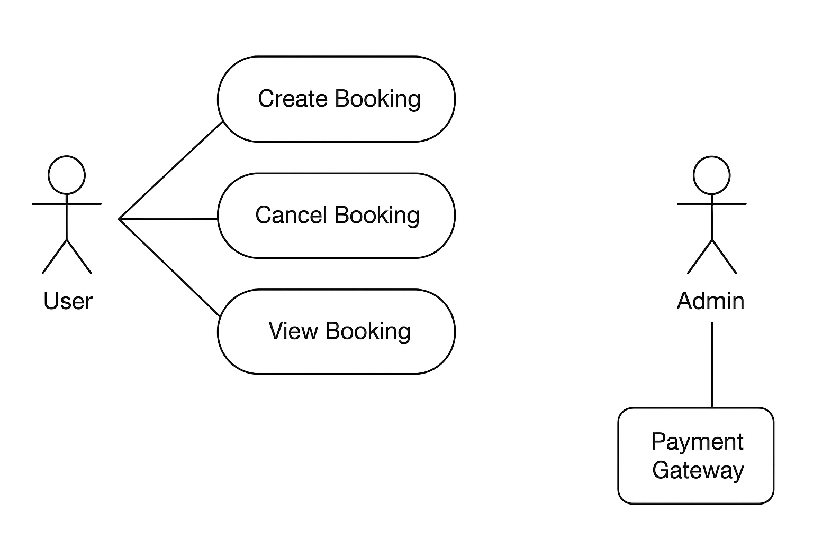

# Requirement Analysis in Software Development

This repository contains a complete overview of **Requirement Analysis** in the Software Development Life Cycle (SDLC).  
Its purpose is to document key concepts, activities, and examples to help developers and stakeholders understand the critical role of requirement analysis in successful software projects.

---

## What is Requirement Analysis?
Requirement Analysis is the process of **identifying, documenting, and validating the needs and expectations of stakeholders** for a software system.  
It ensures that the development team and the client share a common understanding of what the software should do.  
This process reduces misunderstandings, prevents scope creep, and sets the foundation for design and implementation.

---

## Why is Requirement Analysis Important?
Requirement Analysis is critical in the SDLC for several reasons:
- **Clear Understanding of Needs:** Ensures the development team fully understands user and business requirements.
- **Prevents Costly Mistakes:** Detecting issues early is far cheaper than fixing them during development or after release.
- **Better Planning:** Provides accurate estimates for time, cost, and resources required for the project.

---

## Key Activities in Requirement Analysis
The main activities include:
- **Requirement Gathering:** Collecting information from stakeholders, users, and existing systems.
- **Requirement Elicitation:** Using techniques like interviews, surveys, and workshops to extract detailed needs.
- **Requirement Documentation:** Creating clear, structured documents like SRS (Software Requirement Specification).
- **Requirement Analysis and Modeling:** Studying requirements for feasibility and representing them using models or diagrams.
- **Requirement Validation:** Verifying that documented requirements meet the user’s needs and are complete and consistent.

---

## Types of Requirements

### Functional Requirements
These describe **what the system should do**.  
Example (Booking Management System):  
- Users can create, view, and cancel bookings.  
- The system sends email notifications after a successful booking.

### Non-functional Requirements
These describe **how the system should perform**.  
Example (Booking Management System):  
- The system should handle **1000 concurrent users** without performance degradation.  
- All pages must load in **under 2 seconds**.

---

## Use Case Diagrams
Use Case Diagrams visually represent **interactions between users (actors)** and the system.  
They help clarify system boundaries and user expectations.

Below is a use case diagram for a simple booking system:

---

## Acceptance Criteria
Acceptance Criteria are **specific conditions** that a software feature must meet to be accepted by stakeholders.  
They ensure all requirements are testable and measurable.

**Example (Checkout Feature):**
- User can complete a booking checkout within **3 steps**.  
- Payment gateway integration must support **credit cards and PayPal**.  
- Confirmation email is sent immediately after successful payment.
